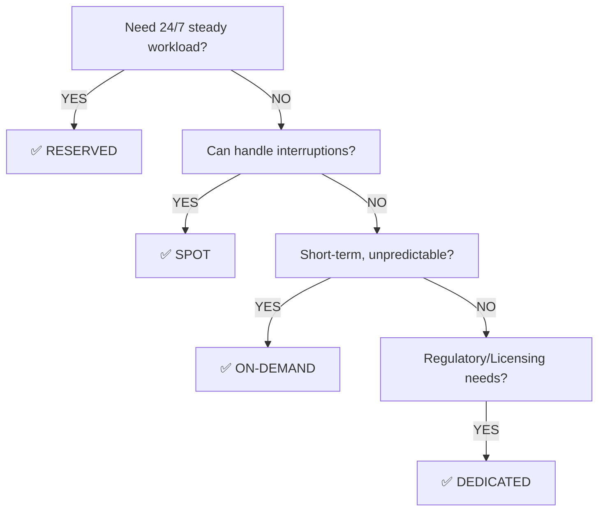
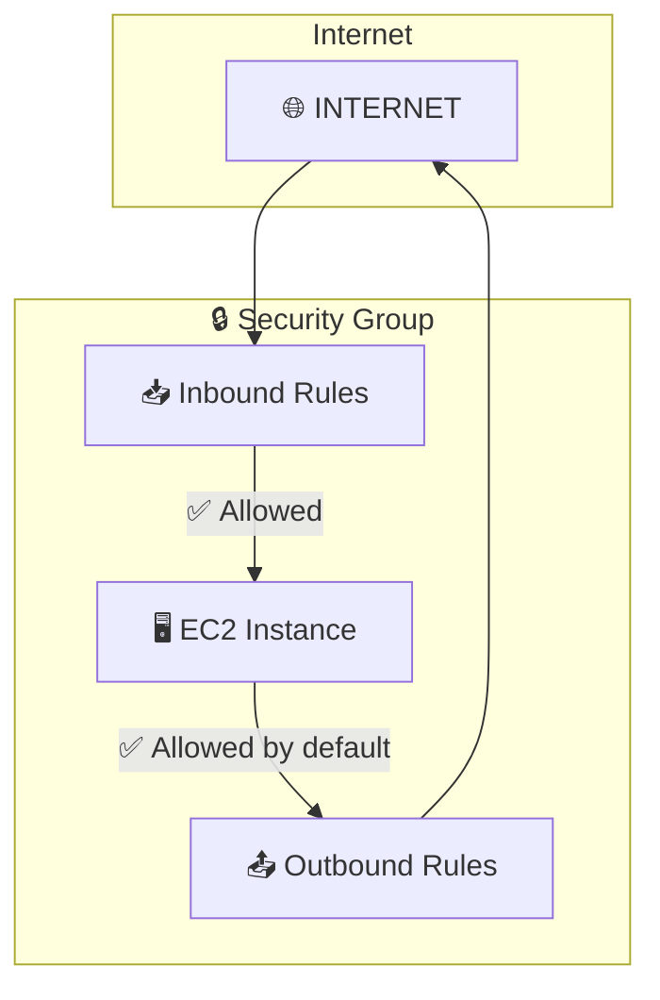
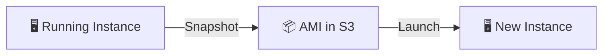
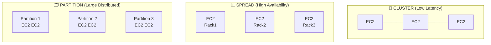
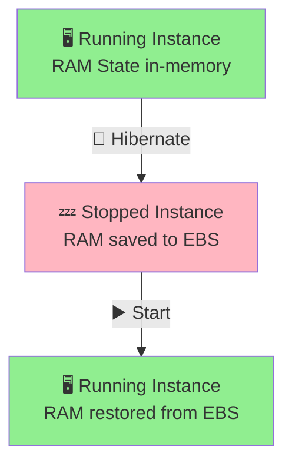

# 🖥️ Amazon EC2 Fundamentals

> [!info] AWS Certified Study Notes
> Last Updated: January 2026

---

## 📋 Table of Contents

- [[#🎯 What is EC2?|What is EC2?]]
- [[#🏷️ EC2 Instance Types|EC2 Instance Types]]
- [[#💰 EC2 Pricing Models|EC2 Pricing Models]]
- [[#🔒 Security Groups|Security Groups]]
- [[#💾 EC2 Storage Options|EC2 Storage Options]]
- [[#🖼️ AMI - Amazon Machine Images|AMI - Amazon Machine Images]]
- [[#📍 EC2 Placement Groups|EC2 Placement Groups]]
- [[#😴 EC2 Hibernate|EC2 Hibernate]]
- [[#🎓 Exam Tips|Exam Tips]]

---

## 🎯 What is EC2?

> [!abstract] Definition
> **EC2 = Elastic Compute Cloud = Infrastructure as a Service (IaaS)**

| Feature | Description |
|---------|-------------|
| 🔄 **Elasticity** | Scale up/down based on demand |
| 💻 **Virtual Machines** | Rent virtual servers in AWS |
| 📦 **Storage** | [[EBS]] volumes for data storage |
| ⚖️ **Load Balancing** | Distribute traffic across instances |
| 📈 **Auto Scaling** | Automatic capacity management |

### EC2 Configuration Options

```
┌─────────────────────────────────────────────────────────────┐
│                    EC2 INSTANCE SETUP                       │
├─────────────────────────────────────────────────────────────┤
│  🖥️  Operating System    → Linux, Windows, Mac OS           │
│  ⚡  Compute Power       → CPU cores (vCPUs)                │
│  🧠  Memory              → RAM (GiB)                        │
│  💾  Storage             → EBS, Instance Store, EFS         │
│  🌐  Network             → Speed, Public IP                 │
│  🔒  Security Group      → Firewall rules                   │
│  📝  User Data           → Bootstrap script                 │
└─────────────────────────────────────────────────────────────┘
```

---

## 🏷️ EC2 Instance Types

> [!tip] Memory Trick
> `GFIRST` → **G**eneral, **F**ull memory, **I**O optimized, **R**eal-time, **S**torage, **T**urbo compute

### Instance Type Naming Convention

```
    m   5   .   2xlarge
    │   │       │
    │   │       └── Size (nano, micro, small, medium, large, xlarge...)
    │   └────────── Generation (higher = newer)
    └────────────── Instance Class
```

### 📊 Instance Families

| Type | Use Case | Example | 🎯 Exam Focus |
|------|----------|---------|---------------|
| **General Purpose** | Web servers, code repos | `t2`, `t3`, `m5`, `m6i` | ✅ Balanced workloads |
| **Compute Optimized** | Batch processing, ML, gaming | `c5`, `c6i`, `c7g` | ✅ High CPU performance |
| **Memory Optimized** | In-memory databases, caching | `r5`, `r6i`, `x1`, `z1d` | ✅ Large datasets in RAM |
| **Storage Optimized** | Data warehousing, OLTP | `i3`, `d2`, `h1` | ✅ High sequential R/W |
| **Accelerated Computing** | GPU, ML inference | `p4`, `g4`, `inf1` | ✅ Hardware accelerators |

### 🔥 Common Instance Types to Remember

```
┌──────────────────────────────────────────────────────────────┐
│                     INSTANCE COMPARISON                      │
├────────────┬─────────────────────┬──────────────────────────┤
│  t3.micro  │  1 vCPU, 1 GiB RAM  │  Free Tier eligible ⭐   │
│  t3.small  │  2 vCPU, 2 GiB RAM  │  Development workloads   │
│  m5.large  │  2 vCPU, 8 GiB RAM  │  General purpose         │
│  c5.xlarge │  4 vCPU, 8 GiB RAM  │  Compute intensive       │
│  r5.large  │  2 vCPU, 16 GiB RAM │  Memory intensive        │
└────────────┴─────────────────────┴──────────────────────────┘
```

---

## 💰 EC2 Pricing Models

### Comparison Chart

| Model | Discount | Commitment | Best For |
|-------|----------|------------|----------|
| 🏷️ **On-Demand** | 0% | None | Short-term, unpredictable |
| 📦 **Reserved** | Up to 72% | 1-3 years | Steady-state usage |
| 💵 **Savings Plans** | Up to 72% | 1-3 years | Flexible usage |
| 🎯 **Spot Instances** | Up to 90% | None | Flexible, fault-tolerant |
| 🏢 **Dedicated Hosts** | Varies | None/Reserved | Compliance, licensing |
| 🖥️ **Dedicated Instances** | Varies | None | Hardware isolation |
| ⚡ **Capacity Reservations** | 0% | None | Guaranteed capacity |

### 🎯 Exam Scenarios



### 📝 Reserved Instance Types

| Type | Flexibility | Discount |
|------|-------------|----------|
| **Standard RI** | Cannot change instance family | Higher (up to 72%) |
| **Convertible RI** | Can change instance family | Lower (up to 66%) |

### Spot Instance Key Points

> [!danger] IMPORTANT FOR EXAM
> Spot instances can be **terminated with 2-minute warning**

- ✅ Great for: Batch jobs, data analysis, image processing
- ❌ NOT for: Critical applications, databases

---

## 🔒 Security Groups

> [!note] Definition
> 🛡️ **Security Groups = Virtual Firewall for EC2 instances**

### Key Characteristics

> [!success] Security Group Rules
> - ✅ ALLOW rules only (no DENY rules)
> - ✅ Stateful (return traffic auto-allowed)
> - ✅ Can reference other SGs or IP addresses
> - ✅ All inbound traffic BLOCKED by default
> - ✅ All outbound traffic ALLOWED by default
> - ✅ Can be attached to multiple instances
> - ✅ Locked to Region/VPC combination

### 🎯 Common Ports to Remember

| Port | Protocol | Service | 📝 Notes |
|------|----------|---------|----------|
| **22** | TCP | SSH | Linux instances |
| **21** | TCP | FTP | File Transfer |
| **22** | TCP | SFTP | Secure File Transfer |
| **80** | TCP | HTTP | Web traffic |
| **443** | TCP | HTTPS | Secure web traffic |
| **3389** | TCP | RDP | Windows instances |
| **3306** | TCP | MySQL/Aurora | Database |
| **5432** | TCP | PostgreSQL | Database |

### Security Group Rules Diagram



---

## 💾 EC2 Storage Options

### Storage Types Comparison

| Storage | Persistence | Speed | Use Case |
|---------|-------------|-------|----------|
| **[[EBS]]** | ✅ Persists | ⚡ Fast | Boot volumes, databases |
| **Instance Store** | ❌ Ephemeral | ⚡⚡ Fastest | Temp data, cache |
| **[[EFS]]** | ✅ Persists | ⚡ Fast | Shared file storage |
| **[[S3]]** | ✅ Persists | 🔄 Variable | Object storage |

### 📦 EBS Volume Types

> [!example] EBS Volume Categories
> 
> **🔷 SSD-Based** (IOPS performance)
> - `gp2`/`gp3` (General Purpose) → Boot volumes, dev/test
> - `io1`/`io2` (Provisioned IOPS) → Mission-critical DBs
> 
> **🔶 HDD-Based** (Throughput performance)
> - `st1` (Throughput Optimized) → Big data, log processing
> - `sc1` (Cold HDD) → Infrequent access data

### 🎯 EBS Quick Reference

| Type | IOPS | Throughput | Boot? | Use Case |
|------|------|------------|-------|----------|
| **gp3** | 16,000 | 1,000 MB/s | ✅ | Default choice |
| **gp2** | 16,000 | 250 MB/s | ✅ | Legacy workloads |
| **io2** | 64,000 | 1,000 MB/s | ✅ | High-performance DBs |
| **st1** | 500 | 500 MB/s | ❌ | Big data |
| **sc1** | 250 | 250 MB/s | ❌ | Archive |

> [!warning] Exam Tip
> Only **SSD volumes (gp2, gp3, io1, io2)** can be boot volumes!

---

## 🖼️ AMI - Amazon Machine Images

### What is an AMI?

> [!abstract] Definition
> 📦 **AMI = Pre-configured template for EC2 instances**

> [!info] AMI Contains
> - 🖥️ Operating System
> - 📦 Pre-installed software
> - 🔧 Launch permissions
> - 💾 Block device mapping ([[EBS]] volumes)

### AMI Types

| Type | Description | Example |
|------|-------------|---------|
| **AWS Provided** | Official AWS AMIs | Amazon Linux 2, Windows Server |
| **Marketplace** | Third-party AMIs | Pre-configured apps |
| **Custom** | Your own AMIs | Golden images |
| **Community** | Shared public AMIs | Various |

### 🔄 AMI Lifecycle



> [!caution] Exam Alert
> AMIs are **Region-specific**! To use in another region, you must **copy** it.

---

## 📍 EC2 Placement Groups

### Placement Strategies



> [!summary] Placement Group Characteristics
> 
> **🏃 CLUSTER**
> - Same Rack, Same AZ
> - ✅ Low latency
> - ❌ Single point of failure
> 
> **📊 SPREAD**
> - Different Racks
> - ✅ Isolated failures
> - ⚠️ Max 7 instances per AZ
> 
> **🗂️ PARTITION**
> - Logical partitions
> - ✅ Great for HDFS, Kafka

### Quick Comparison

| Strategy | Use Case | Limit | Risk |
|----------|----------|-------|------|
| **Cluster** | HPC, Low latency apps | Same AZ | High (same rack) |
| **Spread** | Critical individual instances | 7 per AZ | Low |
| **Partition** | HDFS, Kafka, Cassandra | 7 partitions per AZ | Medium |

---

## 😴 EC2 Hibernate

### How Hibernate Works



### Hibernate Requirements

> [!check] Requirements Checklist
> - [ ] Instance RAM ≤ 150 GB
> - [ ] Root volume must be [[EBS]] (encrypted)
> - [ ] Root volume must have enough space
> - [ ] Supported instance families: C, I, M, R, T (most types)
> - [ ] Available for On-Demand, Reserved, and Spot instances
> - [ ] Max hibernation time: ==**60 days**==

---

## 🎓 Exam Tips

### ⭐ Key Points to Remember

> [!important] EXAM MUST-KNOWS
> 
> 📌 Security Groups are **STATEFUL**, NACLs are **STATELESS**
> 
> 📌 Spot instances can be terminated with ==2-min warning==
> 
> 📌 Reserved Instances: 1 or 3 years, up to **72% discount**
> 
> 📌 Instance Store = ephemeral, [[EBS]] = persistent
> 
> 📌 Only **SSD volumes** can be boot volumes
> 
> 📌 AMIs are **REGION-SPECIFIC**
> 
> 📌 Spread placement: max **7 instances per AZ**
> 
> 📌 Hibernate: RAM saved to encrypted EBS, max **60 days**
> 
> 📌 User Data runs **ONCE** at first boot (as root)
> 
> 📌 SSH = Port 22, RDP = Port 3389, HTTP = 80, HTTPS = 443

### 🧠 Memory Aids

| Concept | Memory Trick |
|---------|--------------|
| Instance Types | **GFIRST**: General, Full-memory, IO, Real-time, Storage, Turbo |
| Spot vs Reserved | **Spot = Spontaneous** (can disappear), **Reserved = Reliable** |
| gp2 vs io2 | **gp = general people**, **io = important operations** |
| Hibernate | Think "**Bear mode**" 🐻 - sleeps but wakes up where it left off |

---

## 📝 Practice Questions Space

> [!question]- Q1: Add your question here
> _Your notes here..._

> [!question]- Q2: Add your question here
> _Your notes here..._

> [!question]- Q3: Add your question here
> _Your notes here..._

---

## 🔗 Quick Reference Links

- 📖 [AWS EC2 Documentation](https://docs.aws.amazon.com/ec2/)
- 💰 [EC2 Pricing Calculator](https://calculator.aws/)
- 📋 [Instance Type Comparison](https://aws.amazon.com/ec2/instance-types/)

---

## Related Notes

- [[AWS VPC]]
- [[EBS]]
- [[EFS]]
- [[S3]]
- [[Auto Scaling]]
- [[Elastic Load Balancing]]

---

> [!quote] Good luck with your AWS exam! 🚀
> *Created for AWS Certification Preparation*

%%
Internal notes:
- Review security groups section
- Add more practice questions
- Link to hands-on labs
%%
